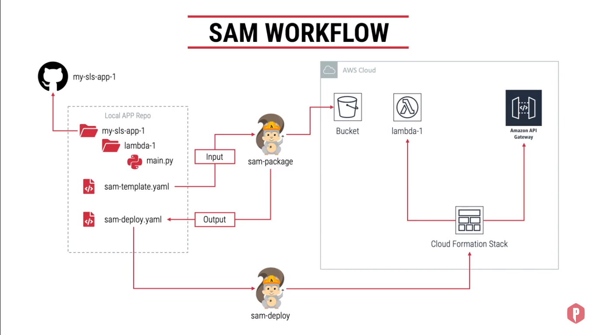

# Serverless Application Model (AWS SAM)
A Token Based Lambda Authorizer is called when a client request one of your API's method, API Gateway calls the lambda authorizer, which takes the caller's identity as input and returns an IAM policy as output.
While Calling the API we need to pass a header of `authorizationToken`, if the value of `authorizationToken` is `allow` it grant access, API gateway executes the method.

### SAM Workflow

